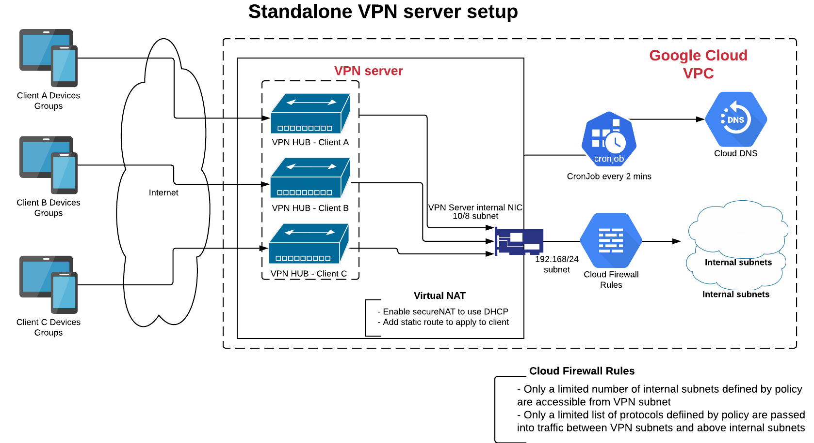

# PlayiO VPN

**Play-iO** IIoT VPN solution

## VPN Client

### Supported Operating system

| Distro      | Release        | Architecture | Status                                                          |
| ----------- | -------------- | ------------ | --------------------------------------------------------------- |
| Raspbian    | Stretch/Buster | ARM          | &#10004;                                                        |
| BeagleBoard | Stretch/Buster | ARM          | &#10004;                                                        |
| OpenWRT     | 18.x/19.x      | ARM/Mips     | :white_large_square:                                            |
| Ubuntu      | 16.x/18.x/20.x | ARM/x86_64   | &#10004;                                                        |
| Debian      | 9/10           | ARM/x86_64   | &#10004;                                                        |
| Fedora      | 31/32/33       | ARM/x86_64   | :warning: [SELinux](https://github.com/play-iot/iot-vpn/issues/10) |
| CentOS      | 6/7/8          | ARM/x86_64   | :warning: [SELinux](https://github.com/play-iot/iot-vpn/issues/10) |
| RHEL        | 7.x/8.x        | ARM/x86_64   | :warning: [SELinux](https://github.com/play-iot/iot-vpn/issues/10) |
| Windows     | 8/10           | x86_64       | :warning: [SoftetherVPN](https://www.softether.org/)            |
| MacOS       | 7.x/8.x        | x86_64       | :white_large_square:                                            |
| Android     | 7.x/8.x        | x86_64       | :white_large_square:                                            |

### Support DNS resolver

- [x] `NetworkManager`
- [x] `systemd-resolver`
- [x] `resolvconf`
- [x] `openresolv`
- [x] `connman`

### How to use

Please read [VPNC README](./cli/python/src/client/README.md)

## VPNC Deployer

The `CLI` tool based on `ansible` and `docker` to mass deploy VPN client on one or many devices/computers.

## VPN DDNS

The `CLI` application syncs every 2 minutes VPN client IP addresses to private Google Cloud DNS:

- DNS zone name for each customer: `device.<customer-code>`
- Device DNS name: `<device-hostname>.device.<customer-code>`

## How to contribute

Please read [SETUP.md](SETUP.md) to setup your environment.
